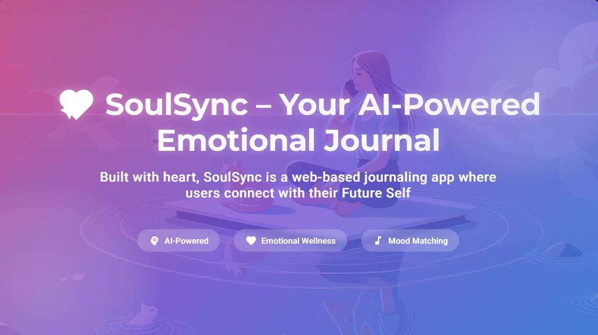

# 💖 SoulSync – Your AI-Powered Emotional Journal

<p align="center">
   
</p>

**Built with heart**, SoulSync is a web-based journaling app where users connect with their *Future Self*.  
It uses the power of **Generative AI + Emotion Detection + Music** to turn thoughts into a comforting, creative, and healing experience.

---

## 🌟 What is SoulSync?

**SoulSync** is a web application built with modern web technologies and integrated with **GenAI**.  
It helps you reflect on your day, understand your emotions, and feel supported by a wiser, caring version of yourself — your *Future Self*.

Every entry you write is gently analyzed for mood. Based on your words and personal goals, the app:
- Talks back to you with **personalized, RAG-based AI responses**
- Changes the background based on your emotion (no labels — just feeling!)
- Plays **mood-matching music** via YouTube, Spotify, or **AI-generated tracks**
- Shows a cute, uplifting **avatar** that evolves with your journey

---

<p align="center">
   
</p>

## 💻 Built With
- **Frontend**: React, Tailwind CSS, TypeScript, Vite
- **AI/LLM**: Groq API (Gemma2-9b-it) via Supabase Edge Functions
- **Music**: YouTube + Spotify API + Custom AI-generated MP3s
- **RAG System**: Onboarding answers + journaling data
- **Hosting**: Lovable (for now), ready for Vercel or Firebase

---

## ✨ Features

- 🧠 **AI that Feels**: Talk to your *Future Self* based on your own goals and moods
- 🎶 **Emotional Music**: Soothing tracks that match how you feel
- 🎵 **AI-Generated Music**: Each mood can play exclusive music created by AI — no need to rely on existing tracks only
- 🖼️ **Adorable Avatar**: Duolingo-style character or your own future face
- 🌈 **Mood-Driven Design**: Background changes with emotions — no words needed
- 📚 **Built with RAG**: Personal answers fuel deeper, humanlike responses

---

## 🔧 How It Works

1. On sign-up, you answer soulful questions about your dreams and future.
2. Each time you journal:
   - Your **mood is detected**
   - Your entry is sent to **Gradio/Groq** with your past data (RAG)
   - A loving **AI message is returned**
   - Your **avatar appears**, background shifts, and music (AI or Spotify) plays

---

## 🧪 Try It Live
👉 [SoulSync Demo](https://drive.google.com/drive/my-drive?dmr=1&ec=wgc-drive-hero-goto)

---

## 🔐 Setup (Locally)

```bash
git clone 
cd soul-sync-ai-journal
npm install
npm run dev
````

Create a `.env` with:

```env
VITE_GROQ_API_KEY=your_groq_key
VITE_SPOTIFY_CLIENT_ID=your_spotify_client_id
VITE_SPOTIFY_CLIENT_SECRET=your_spotify_secret
```


## 🌍 Why It Matters

> **“Tech is powerful — but it should also be kind.”**
> SoulSync isn’t just another AI app. It’s a soft space in the chaos.
> A place where Gen Z minds can breathe, feel heard, and reflect — with tech that listens and sings.


> 🪄 **Made with 💖 for the CS Girlies Hackathon**
> For the dreamers, builders, and future changemakers.

```


